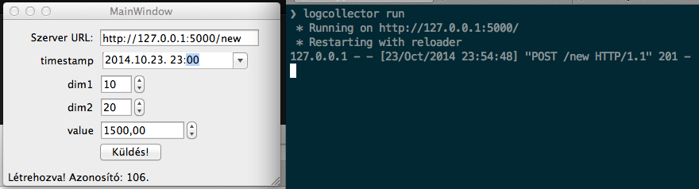
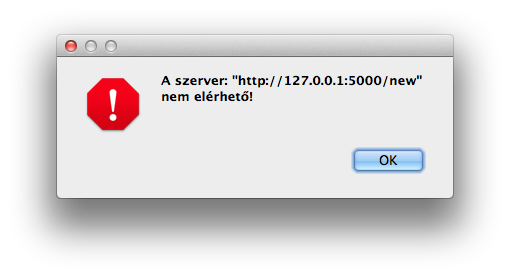

A program egy egyszerű asztali alkalmazás, ami tetszőleges URL-en hallgatózó logcollector servernek küld POST requestet a megadott adatokkal.

Sikeres létrehozás esetnén a státuszsorban jelzi a művelet eredményét:

Minden küldéskor ellenőrzi hogy a szerver elérhető-e, amennyiben nem egy figyelmeztető ablakkal jelzi a küldés sikertelenségét:

Használatához Python 3.4, PyQT4 framework és a requests Python library szükséges.
